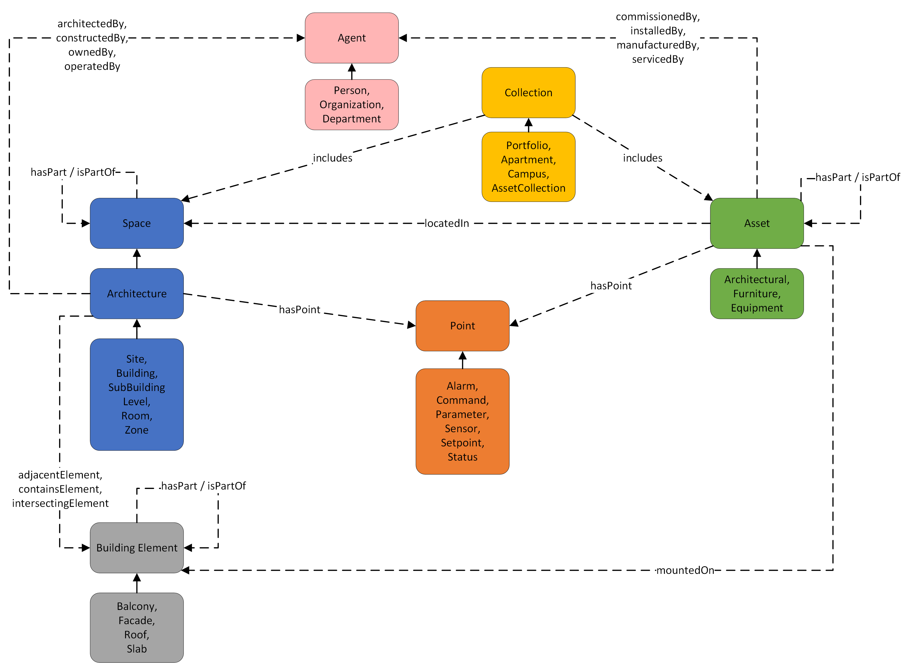

# RealEstateCore - for and by property owners

Ever increasing amounts of data are generated by and within buildings. Several different systems exist to control climate, lighting, access control, etc., not to mention all the new data sources that emerge from IoT devices, all of which generate data. These large amounts of heterogeneous data need to be organized. Please visit: https://www.realestatecore.io/

## What is the RealEstateCore?
RealEstateCore is a common language that will enable control over buildings and development of new services – the facilitator of the promises of a digital transformation. RealEstateCore is a domain ontology preparing buildings to interact with the Smart City.

RealEstateCore is not aiming to be a new standard, but we rather intend for it bridge existing standards and find the common denominators. RealEstateCore uses and maps such existing standards in a pragmatic manner by adding annotations (which can be reused by the community directly if needed).

## RealEstateCore structure

The figure above illustrates the overall REC structure and key design points, which are described in greater detail below. Note that this an introductory subset of the REC constructs; [the browsable reference documentation](https://dev.realestatecore.io/ontology/) contains a list of all types and all of their properties. For concrete modelling examples, see our [Guides](https://dev.realestatecore.io/docs/guides/).

RealEstateCore employs a set of design principles:

* Parthood is described using the `hasPart` and `isPartOf` relationships. Instances of a type can only have other instances of the same type as parts; e.g., assets can only have assets as parts, spaces can only have spaces, and so forth. This provides a simple a consistent way for developers to navigate the building topology. To jump across these topologies (e.g., to indicate that an asset has a spatial location), other specific properties are used, see below.
* Spatial location is described using `locatedIn` and `isLocationOf` relationships together with some `Space` instance.
* Administrative parthood, i.e., membership in a `Collection`, is described using the outgoing `Collection` relationship `includes`.

**Spaces**
A `Space` is contiguous part of the physical world that has a 3D spatial extent and that contains or can contain sub-spaces. For example a *Region* can contain many *Sites*, which in turn can contain many *Buildings*, which in turn can contain *Levels* and *Rooms*. This concept is comparable to a [Zone](https://w3id.org/bot#Zone) in the [BOT ontology](http://w3id.org/bot). Note that we differentiate between spaces that are designed/architected (subtypes of `Architecture`) and spaces that are not; the former have a number of properties specific to constructed spaces.

**Building elements**
A `BuildingElement` is a part that constitutes a piece of a building's structural makeup, for example Facade, Wall, Slab, RoofInner, etc.

**Assets**
An `Asset` is an object which is placed inside of a building, but is not an integral part of that building's structure. We provide a hierarchy of assests, for example architectural, furniture, etc. Our Equipment asset hierarchy is sourced from our collaboration with [Brick Schema](https://brickschema.org/).

**Points, sensing and actuating**
A `Point` indicates the capacity of an entity, be it an Architecture, an Asset, to produce or ingest data. The Point hierarchy is sourced from our collaboration with [Brick Schema](https://brickschema.org/). Specific subclasses specialize this behavior: `Sensor` entities harvest data from the real world, `Command` entities accept commands from a digital twin platform, and `Setpoint` entities configure some capability or system, etc. Points are connected to spaces or assets using the `hasPoint` and `isPointOf` relations.

The `Event` class includes subclasses that can be utilized to represent individual observations or command actuations in a REC-based system, e.g., `ObservationEvent` or `ActuationEvent`.

**Collections**
`Collection` covers administrative groupings of entities that are adressed and treated as a unit for some purpose. These entities may have some spatial arrangement (e.g., an apartment is typically contiguous) but that is not a requirement (see, e.g., a distributed campus consisting of spatially disjoint plots or buildings).

**Agents, Persons, and Organizations**
`Agent` describes any basic types of stakeholder that can have roles or perform activities, and is subclassed into, e.g., people, companies, departments. This bears some resemblance to FOAF, which it was originally inspired by, but has since diverged due to requirements shift.

## Publications

If have been using RealEstateCore as part of your research, please cite us. The key paper to cite is:

* Hammar K., Wallin E.O., Karlberg P., Hälleberg D. (2019) **The RealEstateCore Ontology**. In: Ghidini C. et al. (eds) The Semantic Web – ISWC 2019. ISWC 2019. Lecture Notes in Computer Science, vol 11779. Springer, Cham
**DOI:** https://doi.org/10.1007/978-3-030-30796-7_9

## What are the benefits for the property owners?
Property owners can use RealEstateCore to describe the data of interaction within the buildings that they operate – as well as the management, storage, and sharing of this data. RealEstateCore is a modular ontology, that is, a collection of data schemas that describe concepts and relations that can occur in data that is generated to model buildings and building systems, or that is sourced from such systems. For instance, RealEstateCore covers building structures, ownership, inhabitants, technical systems and sensors, events, etc.

## How to contribute?
The RealEstateCore consortium is working on improving the core ontology, adding more modules, and as well is working on making better tools to integrate and use the ontology in smart building platforms and its applications.

We encourage you to contribute to make RealEstateCore better. Please point out bugs or peculiarities, add or extend definitions, and suggest improvements in order to evolve the RealEstateCore. See our [Community page](https://dev.realestatecore.io/community/) for more guidance.

* Comment or create a new Issue for bug reporting
* For improvements, please fork the rec repository, make your changes and send a pull request
* [Join our chat](https://gitter.im/RealEstateCore/community)
